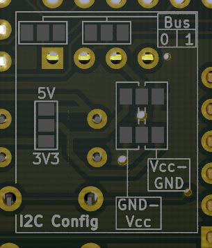
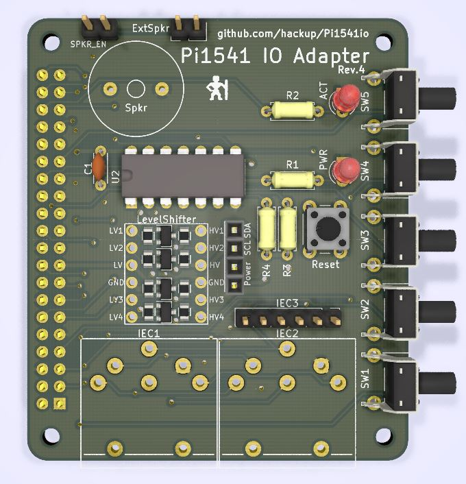
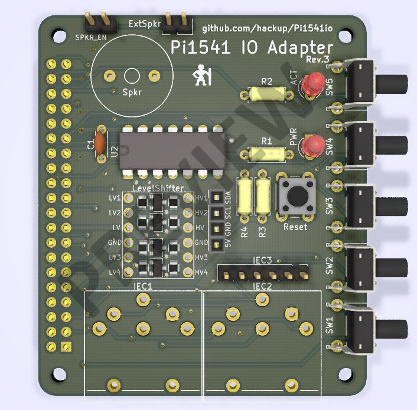
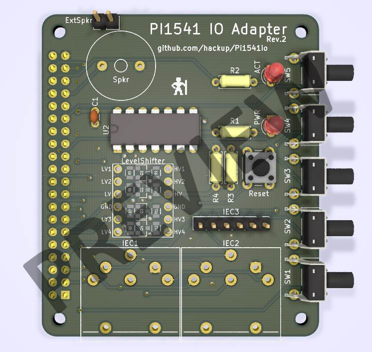
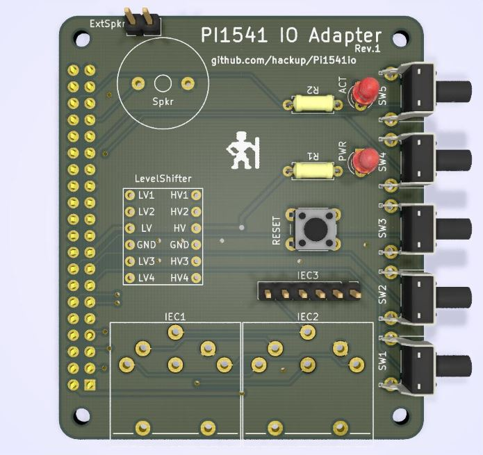

# PI1541 IO Adapter

This is an IO adapter board for the Raspberry Pi 3, based on the awesome [Pi1541
project](https://cbm-pi1541.firebaseapp.com/) by Steve White. It is currently
very much work in progress. **USE AT YOUR OWN RISK!**

Details of the adapter board development are [documented on hackup.net](https://www.hackup.net/tag/pi1541/). The [Gerber files](gerber/Pi1541io-rev4.zip) for the latest stable revision are included in the repository. Also, the boards are ready to be ordered directly from [PCBWay](https://www.pcbway.com/project/shareproject/Pi1541_IO_Adapter__Rev_4.html?inviteid=78096) or [DirtyPCBs](https://dirtypcbs.com/store/designer/details/hackup/6112/pi1541-io-adapter-rev-4).

## Revisions

### Revision 4
This revision of the board resolves the I2C power supply issues of the previous version. All relevant aspects of the I2C header must now be configured using solder bridges on the bottom side of the PCB.

* Select either 3.3V or 5V power supply. (If in doubt, use 3.3V!)
* Pin order: Vin-GND-SCL-SDA or GND-Vin-SCL-SDA
* Chose either I2C bus 0 or 1

See [here](https://www.hackup.net/2018/07/pi1541io-revision-4/) for more details.

### Revision 3
The third revision features an I2C header for connecting a SSD1306 based OLED display module. The power line on this header is connected to 5V of the Raspberry. This is the preferred option for display modules that bring their own 3.3V regulator. Unfortunately, there seem to be modules out there without such a regulator. Connecting one of those to 5V will damage both the display and the Raspberry.

This issue is resolved in revision 4. So, unless you already have one of these boards you better skip directly to revision 4.

### Revision 2
The second revision features quite a few improvements, the most important one being optional support for the 7406 bus driver IC. For further details and instructions on how to assemble this board [see here](https://www.hackup.net/2018/06/pi1541io-revision-2/).

### Revision 1
A prototype batch of the first revision has been manufactured and [tested](https://www.hackup.net/2018/05/pi1541-io-adapter/). It is generally working but there are a few minor issues. The Gerber files for this revision are included, but I would currently recommend waiting for revision 2.

## License

This work is licensed under a
[Creative Commons Attribution-ShareAlike 4.0 International License](http://creativecommons.org/licenses/by-sa/4.0/)
